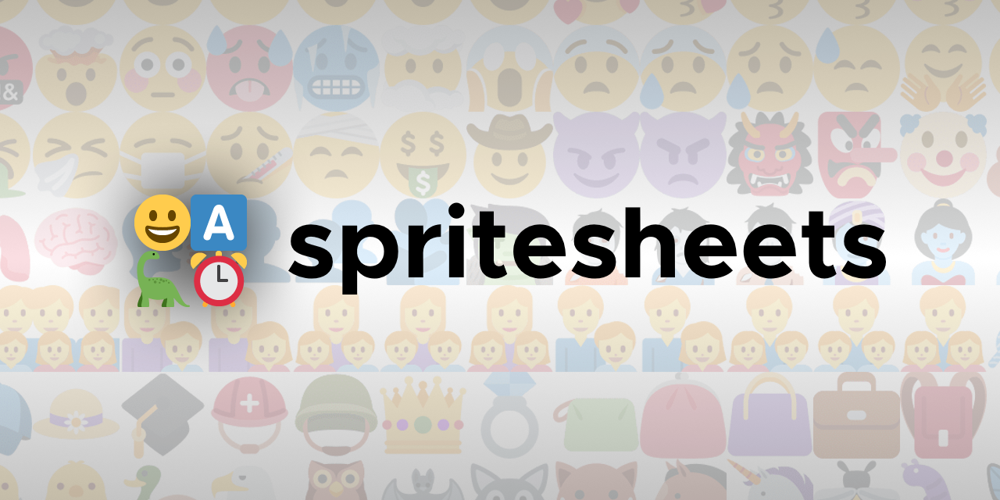

Utility to generate emoji spritesheets using `node-canvas`. Examples using twitter's [Twemoji](https://github.com/twitter/twemoji) are provided in `/spritesheets/`.

## Usage
- Place all your emoji in `/72x72/`.
  - Missing emoji will be rendered as empty. If you need assistance with debugging you can uncomment some lines down in the script in order to enable a "missing" texture.
  - I recommend using an emoji set like twemoji as a "fallback" if whatever set you use doesn't provide full coverage.
-  Run `node render`.

**!** Some emoji sets like twitter use a different file name format. Refer to [render-twitter](./render-twitter.js) for a twemoji compatible script.